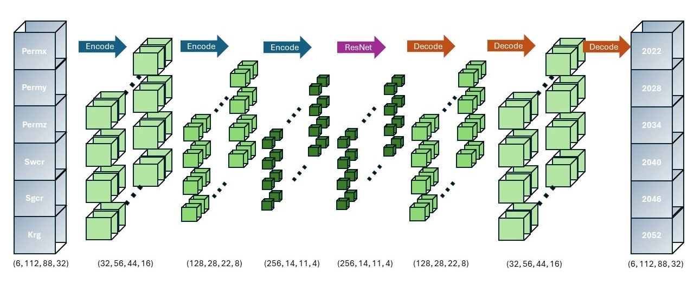

# WebAI
This is a web application including several AI functionalities, such as data loading, processing, training and prediction. This package originally developed for estimating subsurface CO2 flow simulation.

Function API can be found [here](https://acse-efk23.github.io/WebAI/).

### Deep Learning Architecture
---


### Comparison with Physics-Based Simulation
---


### Web Application
---


### Usage
---
1. Clone the repository:
```bash
git clone https://github.com/acse-efk23/webai.git
```

2. Change directory:
```bash
cd webai
```

3. Create an environment (`-m` means run as a module):
```bash
python -m venv .venv
```

4. Activate the environment:
```bash
.venv\Scripts\activate
```

5. Install the requirements:
```bash
pip install -r requirements.txt
```

6. Install the deepdown package:
```bash
pip install .
```

7. Install the web plugins package:
```bash
cd web_plugins
pip install .
```

8. Run the application (viewed in local host):
```bash
cd ..
webviz preferences --browser chrome
webviz build configuration.yaml
```

### Acknowledgements
The web application is built through an open source Python package developed by Equinor which can be found [here](https://github.com/equinor/webviz-config).
